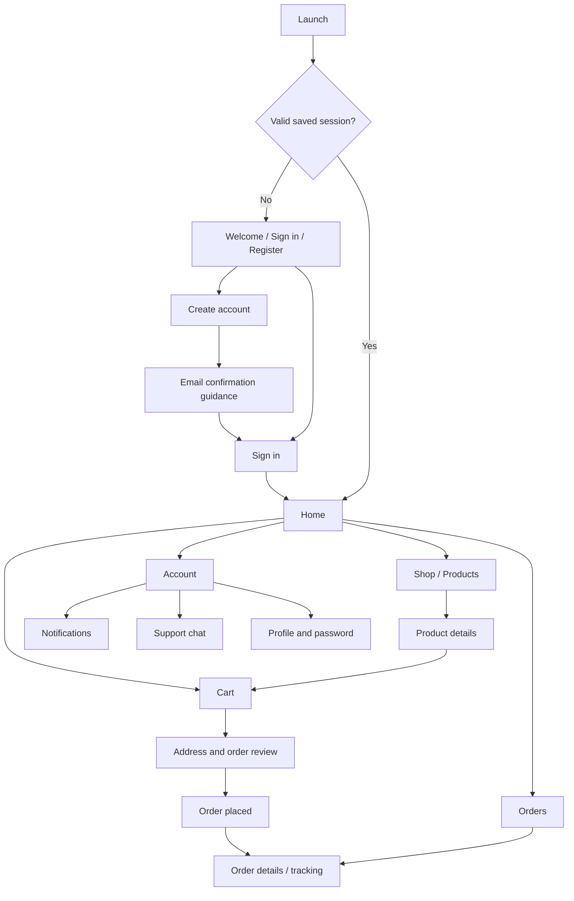

# Flutter Customer App — UI Plan

## Goal

Build a customer-facing Flutter mobile app for the existing Pharmacy API. Keep the app focused on customer shopping and support; the admin interface will be a separate web client. This is a planning document, not an implementation or a finalized visual brand.

## Current backend fit and items to resolve

- Customer endpoints are protected by the `Customer` role. This includes Home and Product, so the current API does not support anonymous catalog browsing.
- Registration is followed by email confirmation; login returns a JWT access token. The UI needs a confirmation and resend-confirmation path.
- Checkout currently accepts cash only. The API explicitly rejects credit card checkout, so payment method selection and online payment UI should wait until the gateway contract is implemented.
- Checkout sends delivery address, optional notes, and `PaymentMethod`; cart contents are read from the server cart. The client should not submit its own authoritative price or order total.
- Several successful API actions return `ApiResponse<T>`, while some return direct response types. Implement response parsing per endpoint rather than assuming one envelope everywhere.
- Product response fields currently include name, generic name, price, minimum stock level, prescription flag, and category ID; no product image URL or category name is included in this response.
- The generated registration and resend-confirmation links now target `AuthController/ConfirmEmail`.
- The backend uses two chat paths: REST endpoints for loading/sending messages and SignalR hub methods for live messaging. Pick one sending path for the client to avoid duplicate messages; suggested initial plan is REST for loading and sending, SignalR for receiving live events.

## App navigation

Use a bottom navigation bar for the signed-in shopping experience:

Suggested tabs: **Home**, **Shop**, **Cart**, **Orders**, **Account**. Notifications can be an icon in the app bar and also appear in Account. Support chat and profile sit under Account.

## Screen plan and API mapping

| Screen / flow | API mapping | UI behavior |
| --- | --- | --- |
| Welcome / Sign in | `POST /api/Identity/Auth/Login` | Accept username or email and password. Store the returned access token securely. Handle invalid credentials, locked account, and unconfirmed email messages. |
| Register | `POST /api/Identity/Auth/Register` | Collect first/last name, username, email, password, confirmation. Show a check-your-email state after success. |
| Confirm email / resend | `GET /api/Identity/Auth/ConfirmEmail`; `POST /api/Identity/Auth/ResendEmailConfirmation` | Confirmation is opened from the email link. Both registration and resend now generate links to the `AuthController` action. |
| Forgot password | `POST /api/Identity/Auth/ForgetPassword`; `POST /api/Identity/Auth/VerifyOTP`; `POST /api/Identity/Auth/ResetPassword` | Three-step flow: request OTP, verify it, set new password using returned user ID and reset token. |
| Home | `GET /api/Customer/Home` | Show categories, product picks, and up to five recent orders from `CustomerHomeResponse`. This currently needs a customer login. |
| Product listing | `GET /api/Customer/Product` | Show products and category filtering client-side initially; handle empty results. Product list endpoint currently requires customer login. |
| Product details | `GET /api/Customer/Product/{id}` | Show available fields and prescription-required flag. Add-to-cart action should be clear; image is unavailable unless backend adds an image field. |
| Cart | `GET /api/Customer/Cart` | Show server cart, quantities, line totals and server total. Refresh after each mutation. |
| Add to cart | `POST /api/Customer/Cart/items` with `AddToCartRequest` | Submit product ID and quantity. Show confirmation and update cart badge. |
| Edit / remove cart line | `PUT /api/Customer/Cart/items/{id}`; `DELETE /api/Customer/Cart/items/{id}`; clear with `DELETE /api/Customer/Cart` | Update the backend, then reload cart to reflect its calculated prices. |
| Checkout | `POST /api/Customer/Checkout` with `CheckoutRequest` | Collect delivery address and optional notes. Until payment gateway support lands, present cash only. On success show order confirmation and navigate to order detail. |
| Orders | `GET /api/Customer/Orders`; `GET /api/Customer/Orders/{id}` | List recent and past orders, status, date and amount; show line items and delivery details on the detail screen. |
| Order actions | `POST /api/Customer/Orders/{id}/arrived`; `POST /api/Customer/Orders/{id}/cancel` | Show only when the order state permits; refresh order after action. Confirm cancellation in the UI. |
| Notifications | `GET /api/Customer/Notifications`; `PUT /api/Customer/Notifications/{id}/read`; `PUT /api/Customer/Notifications/read-all`; `DELETE /api/Customer/Notifications/{id}` | List and manage notifications; connect to `/hubs/notifications` for realtime events. |
| Support chat | `GET /api/Customer/Chat`; `POST /api/Customer/Chat/{chatId}/messages`; SignalR `/hubs/chat` (`JoinChat`, `ReceiveMessage`, `MarkAsRead`) | Load message history via REST, join chat for realtime events, send through one chosen path, and display message delivery/read state where available. |
| Profile | `GET /api/Identity/Profile`; `PUT /api/Identity/Profile/update`; `PUT /api/Identity/Profile/update-password` | Account details, edit profile, update password, and sign out (local token removal). |

## Visual direction (initial proposal)

- Mobile-first, calm pharmacy feel: white surfaces, deep teal or green primary color, warm neutral backgrounds, and a restrained accent color for actions.
- Prioritize readable product names, generic names, clear prices, and prescription-required indicators.
- Use product cards with image placeholders until image URLs are provided by the API.
- Keep checkout short: address, optional note, order summary, payment method, place order.
- Make order status readable as both a label and a progress treatment; use the API status as the source of truth.
- Include clear loading, empty, offline, expired-session, validation, and retry states on every data-driven screen.

## Flutter implementation shape

- **Routing:** declarative routes with an auth gate; deep-link handling for email confirmation.
- **Networking:** one typed API client with base URL per environment, bearer token attachment, timeout handling, and consistent API error parsing.
- **Session:** secure token storage, startup session restore, and clear local session on logout or unrecoverable unauthorized response.
- **Feature organization:** `auth`, `home`, `catalog`, `cart`, `checkout`, `orders`, `notifications`, `chat`, and `profile`, each with models, API/repository layer, state, and screens.
- **State management:** select one app-wide approach before implementation (Riverpod is a reasonable default); keep server state behind repositories so screens do not call HTTP directly.
- **Realtime:** establish authenticated SignalR connections after login; rejoin chat on reconnect and refresh REST data after reconnect or missed events.
- **Configuration:** separate development, staging, and production API URLs. Android emulator and iOS simulator need different local API host addresses than a physical device.

## Delivery phases

1. **API contract pass:** confirm payload/response examples, status enums, token claims and lifetime, CORS, email-confirmation deep link, and anonymous catalog decision.
2. **App foundation:** theme, routing, environment config, API client, secure session, reusable loading/error/empty components.
3. **Authentication:** sign in, register, email-confirmation handoff, resend, forgot/reset password.
4. **Shopping slice:** home, catalog, details, cart, quantity changes, remove and clear.
5. **Order slice:** checkout and confirmation, order list/details, order actions.
6. **Account and engagement:** profile, notifications, support chat, SignalR reconnect behavior.
7. **Payment gateway:** add the backend payment contract first, then design payment selection, provider handoff, success/failure/cancel return states, and order payment status display.

## Decisions to make before visual mockups

1. Should customers be able to browse products before signing in? Current endpoints require a customer token.
2. What app name, logo, preferred language(s), and visual color direction should the UI use?
3. Should checkout capture a free-form address first, or will the backend support saved addresses and structured location fields?
4. Which payment provider and return flow will the backend expose? Add the UI after that contract is ready.

## Proposed first build slice

The first app slice now covers **Register / Sign in → Home → Product list → Product details → Cart → Cash checkout → Order list/details**. Payment gateway integration remains a later slice until its backend contract is available.
