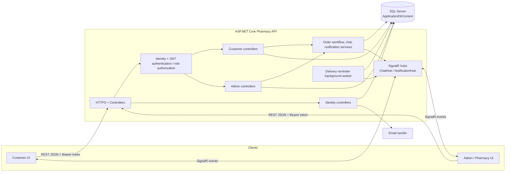

# Pharmacy API — Current System Design

This document describes the API as it exists now and provides a starting map for connecting a customer or admin UI. Route names below follow the current controller attributes; confirm request and response DTOs before implementing each screen.

## 1. System overview



## 2. Main customer UI flow

```mermaid
flowchart TD
    Start([Open customer UI]) --> RegisterLogin[Register / login]
    RegisterLogin -->|Register| EmailConfirm[Confirm email from email link]
    EmailConfirm --> Login[POST /api/Identity/Auth/Login]
    RegisterLogin -->|Existing account| Login
    Login --> Token[Store access token securely]
    Token --> Protected[Send Authorization: Bearer token]
    Protected --> Home[GET /api/Customer/Home]
    Protected --> Browse[GET /api/Customer/Product and /{id}]
    Browse --> Cart[GET /api/Customer/Cart]
    Browse --> Add[POST /api/Customer/Cart/items]
    Add --> Cart
    Cart --> Checkout[POST /api/Customer/Checkout]
    Checkout --> Cash{Cash payment supported?}
    Cash -->|Yes| Order[Order created; cart cleared]
    Cash -->|Credit card| Unsupported[Currently rejected by API]
    Order --> History[GET /api/Customer/Orders]
    History --> Detail[GET /api/Customer/Orders/{id}]
    Protected --> Notify[GET /api/Customer/Notifications]
    Protected --> Chat[GET /api/Customer/Chat]
    Chat <-->|SignalR /hubs/chat| LiveChat[Live chat messages]
    Protected <-->|SignalR /hubs/notifications| NotifyLive[Live notifications]
```

## 3. Main admin / pharmacy UI flow

```mermaid
flowchart TD
    Login[POST /api/Identity/Auth/Login] --> Token[Store access token securely]
    Token --> Bearer[Attach Bearer token to protected requests]
    Bearer --> Role{User role}
    Role -->|Admin / SuperAdmin| Manage[Products, categories, users, customers, batches]
    Role -->|Admin / Pharmacist roles| Ops[Dashboard, orders, batches, invoices, support chats]
    Manage --> ProductAPI[/api/Admin/Products]
    Manage --> CategoryAPI[/api/Admin/Categories]
    Manage --> UserAPI[/api/Admin/Users]
    Manage --> CustomerAPI[/api/Admin/Customers]
    Ops --> Dashboard[/api/Admin/Home/dashboard]
    Ops --> OrderAPI[/api/Admin/Orders]
    Ops --> BatchAPI[/api/Admin/Batches]
    Ops --> InvoiceAPI[/api/Admin/SalesInvoices]
    Ops --> ChatAPI[/api/Admin/Chat]
    ChatAPI <-->|SignalR /hubs/chat| Live[Live chat updates]
    OrderAPI --> Events[Order/status events and notifications]
    Events -->|SignalR /hubs/notifications| UI[Admin UI]
```

## 4. UI integration contract

| Concern | Current API behavior | UI implication |
| --- | --- | --- |
| API base | Controllers use `api/{Area}/{Controller}` | Configure one environment-specific base URL, then append the routes below. |
| Authentication | `POST /api/Identity/Auth/Login` returns an access token. Protected endpoints use JWT bearer auth. | Send `Authorization: Bearer <token>` on protected REST calls. Keep token storage appropriate to the chosen UI platform. |
| Roles | Customer endpoints require the Customer role; admin endpoints generally require SuperAdmin, Admin, or Pharmacist, with some write actions more restricted. | Use role-aware navigation, but treat API authorization as authoritative. Handle 401 and 403 responses. |
| Request / response | JSON DTOs and `ApiResponse` wrappers are used in many actions; some actions return typed response objects directly. | Inspect each action's DTO and status codes; do not assume every response has the same wrapper. |
| Realtime | SignalR hubs are mapped at `/hubs/chat` and `/hubs/notifications`; JWT can be passed via `access_token` query parameter for hub connections. | Connect after login with the token, subscribe to events, and refresh REST data after reconnect where needed. |
| Development API docs | OpenAPI and Scalar are enabled in Development. | Use the generated API reference during UI implementation to confirm payloads. |
| Checkout | The order workflow currently accepts cash only; credit card is explicitly rejected. | Offer cash checkout only until another payment flow is implemented. |

## 5. Current route groups

| UI area | Route prefix | Main capabilities |
| --- | --- | --- |
| Identity | `/api/Identity/Auth` | Register, login, email confirmation, resend confirmation, password reset / OTP |
| Profile | `/api/Identity/Profile` | Get and update signed-in user's profile and password |
| Customer | `/api/Customer/Home`, `Product`, `Cart`, `Checkout`, `Orders`, `Notifications`, `Chat` | Home data, browsing, cart and checkout, order history/actions, notifications, support chat |
| Admin / pharmacy | `/api/Admin/Home`, `Products`, `Categories`, `Users`, `Customers`, `Batches`, `Orders`, `SalesInvoices`, `Chat` | Dashboard and operational management |
| Realtime | `/hubs/chat`, `/hubs/notifications` | Chat and notification events over SignalR |

## 6. Suggested UI connection sequence

1. Set the API base URL per environment and enable HTTPS.
2. Implement login and token handling; register and email confirmation are separate steps.
3. Add one shared HTTP client that attaches the bearer token and normalizes errors.
4. Build the customer or admin screens against their route group, matching each action's request DTO and response type.
5. Add SignalR connections for chat and notifications after the REST flows work; handle disconnect/reconnect and expired tokens.
6. Validate role-specific permissions and empty, loading, success, and error states in the UI.

### Scope note

This is a current-state map derived from the controllers, service registrations, order workflow, and application startup. It is not a proposed deployment diagram. Payment gateway integration and a separate frontend application are not present in this repository yet.
